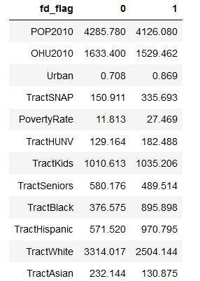

# Mapping-Food-Deserts

## Overview

### Background
"Limited access to supermarkets, supercenters, grocery stores, or other sources of healthy and affordable food may make it harder for some Americans to eat a healthy diet. There are many ways to measure food store access for individuals and for neighborhoods, and many ways to define which areas are food deserts—neighborhoods that lack healthy food sources." - USDA Website

- The USDA Economic Research Service has done a siginificant amount of work, gathering US census data in order to determine where Food Deserts exist in the United States.
### Research Questions
- This projects aims to address the following questions:
    - Where are these food deserts?
    - What common features do food desert areas share?
    - How can we predict whether an area is a food desert?
    
## Data

### Census Data
- This project uses the USDA ERS Food Access Research Atlas, which is publically available here:
- https://www.ers.usda.gov/data-products/food-access-research-atlas/download-the-data/

### TIGER/line Shapefiles
- This project also uses TIGER/line shapefiles of US Census tracts, publically available here:
- https://www2.census.gov/geo/tiger/TIGER2010/TRACT/2010/

## Modeling

### Food Desert Identification
- The goal of this project was to simplify the data presented by the USDA, identify the key factors that determine whether an area is classified as a Food Desert.
- This was accomplished by looking at features within the dataset that did not rely on the mapping and distance calculation work done by the USDA, instead focusing on Socioeconomic and demographic features that would give an understanding of the communities that are described by the data.
- These features were input into Logistic Regression and Random Forest Classifier Models to determine their significance in predicting whether a given area would be considered a Food Desert by the USDA.

#### Features Identified

Food Desert  | No        |  Yes
------------ | --------  | --------:
Population   | 4285.78   | 4126.080

