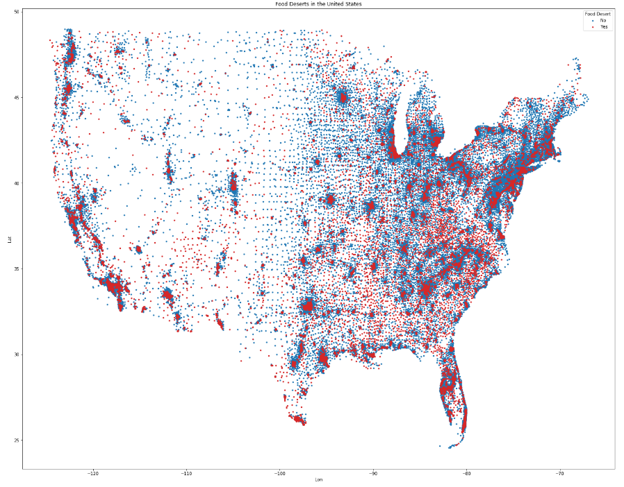

# Mapping-Food-Deserts

## Overview and Current Status
- ML project currently intended to be run in a series of Jupyter Notebooks
Workflow:
1. Load USDA Data -  reads in CSVs and generates flags for later modeling
2. Creating US Shapefile  - downloads and unzips Shapefiles from the US census website
3. Modeling  - uses US census data to determine key features for identifying Food Deserts
4. Mapping - Currently only using Lat/Lon data to create scatter plots, further work using GeoPandas to create more granular maps of areas of interest

### Background
"Limited access to supermarkets, supercenters, grocery stores, or other sources of healthy and affordable food may make it harder for some Americans to eat a healthy diet. There are many ways to measure food store access for individuals and for neighborhoods, and many ways to define which areas are food deserts—neighborhoods that lack healthy food sources." - USDA Website

- The USDA Economic Research Service has done a siginificant amount of work, gathering US census data in order to determine where Food Deserts exist in the United States.
### Research Questions
- This projects aims to address the following questions:
    - Where are these food deserts?
    - What common features do food desert areas share?
    - How can we predict whether an area is a food desert?
    
## Data

### Census Data
- This project uses the USDA ERS Food Access Research Atlas, which is publically available here:
- https://www.ers.usda.gov/data-products/food-access-research-atlas/download-the-data/

### TIGER/line Shapefiles
- This project also uses TIGER/line shapefiles of US Census tracts, publically available here:
- https://www2.census.gov/geo/tiger/TIGER2010/TRACT/2010/

## Modeling

### Food Desert Identification
- The goal of this project was to simplify the data presented by the USDA, identify the key factors that determine whether an area is classified as a Food Desert.
- This was accomplished by looking at features within the dataset that did not rely on the mapping and distance calculation work done by the USDA, instead focusing on Socioeconomic and demographic features that would give an understanding of the communities that are described by the data.
- These features were input into Logistic Regression and Random Forest Classifier Models to determine their significance in predicting whether a given area would be considered a Food Desert by the USDA.

#### Baseline Model, Features and population statistics

Feature (Avg)| Food Desert| Not Food Desert
------------ | ---------  | --------:
Population   | 4126.080   | 4285.780
Housing Units| 1529.462   | 1633.400
Urban (flag) | 0.869 | 0.708
SNAP Recipients | 335.693 | 150.911
Poverty Rate | 27.649 | 11.813
HU w/o Vehicle| 182.488 | 129.164
Kids 0-17| 1035.206 | 1010.613
Seniors 65+ | 489.514 | 580.176
Asian pop.  | 130.875 | 232.144
Black pop.  | 895.898 | 376.575
Hispanic pop.| 970.795 | 571.520
White pop.  | 2504.144 | 3314.017

#### Model Results
- Both the Logistic Regression and Random Forest identified Poverty Rate as the most significant predictor of whether a census tract is designated a Food Desert by USDA
    - USDA defines Poverty Rate as: The share of the tract population living with income at or below the Federal poverty thresholds by family size.
- Other significant features from the model are:
    - Urban (> 2,500 people living in a census tract)
    - TractSNAP (The amount of households currently recieving SNAP benefits)
    - TractHUNV (The amount of households without access to a vehicle)
    
## Further Questions

- County Level Data
    - How can we incorporate supply side features (number of available stores, farms, markets, etc,.) into our models?
- Mapping
    - How can we use shapefiles to get more granular picture of which areas are affected?
- Updating Results
    - How can these models be kept up to date with most current data?

